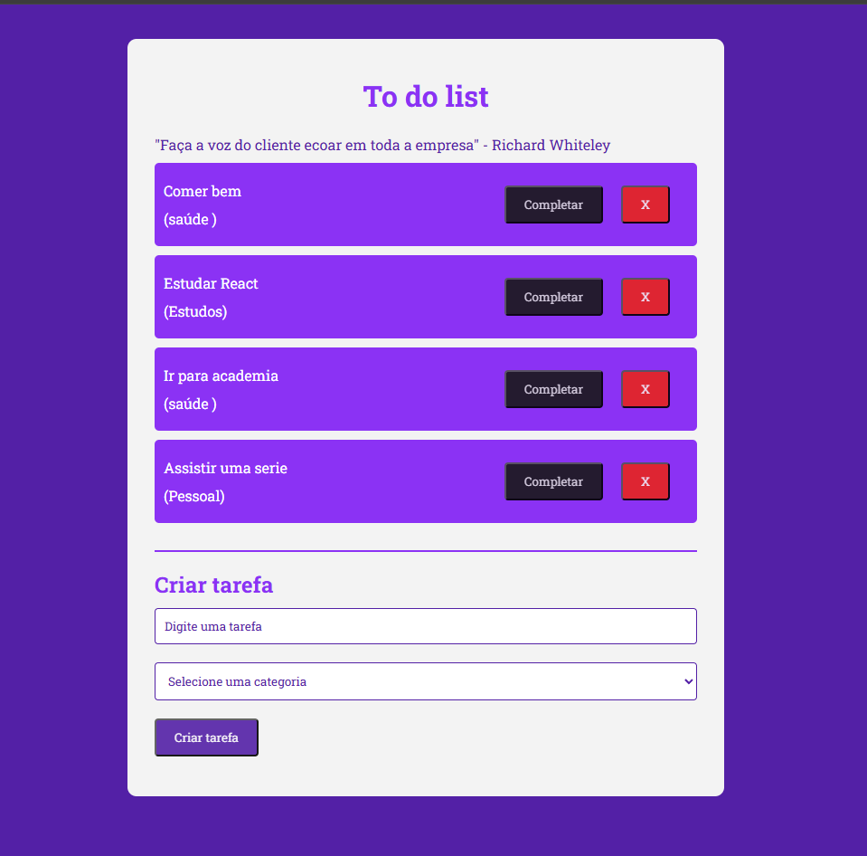
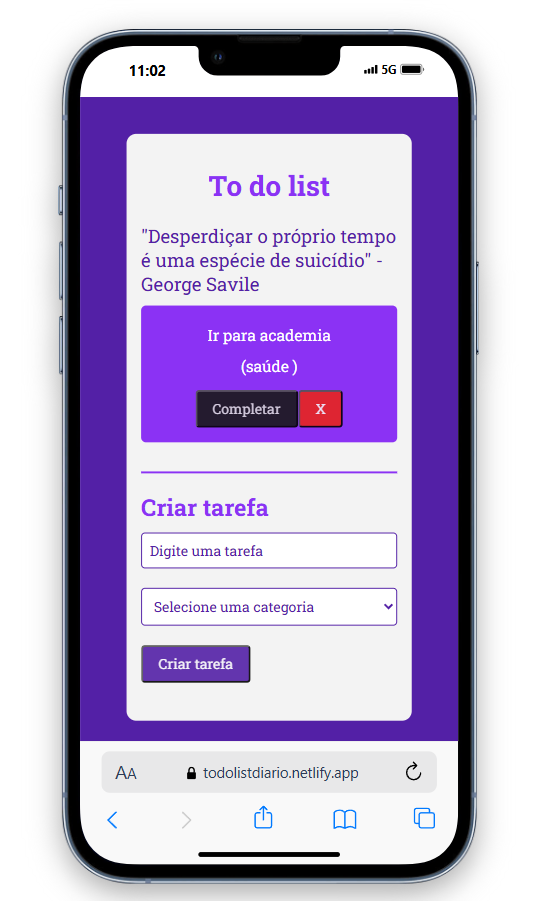

📝 Todo List com React, Vite e LocalStorage 🚀

Este é um Todo List interativo desenvolvido com React e Vite, que permite adicionar, remover e marcar tarefas como concluídas. Além disso, todas as tarefas são salvas automaticamente no localStorage, garantindo que você não perca suas anotações ao recarregar a página.

🔥 Recursos Principais

✅ Adicionar tarefas com título e categoria.
✅ Remover tarefas quando não forem mais necessárias.
✅ Marcar tarefas como concluídas, com efeito visual de risco no texto.
✅ Salvamento automático no LocalStorage, mantendo as tarefas salvas mesmo após fechar o navegador.
✅ Frases motivacionais dinâmicas, que mudam automaticamente a cada poucos segundos para incentivar sua produtividade, consumindo uma API externa para fornecer as frases aleatórias.

🎨 Tecnologias Utilizadas

🔹 React – Para a construção da interface interativa.

🔹 Vite – Para um ambiente de desenvolvimento rápido e otimizado.

🔹 Hooks do React (useState e useEffect) – Para gerenciar o estado das tarefas e sincronizar com o LocalStorage.

🔹 LocalStorage – Para armazenar as tarefas localmente no navegador.

🔹 CSS – Para estilização simples e intuitiva.

🔹 API para Frases Motivacionais – Para trazer frases de inspiração e motivação de maneira dinâmica, mudando a cada intervalo de tempo definido. A API fornece frases aleatórias para manter a produtividade elevada.

Link onde o projeto esta hospedado : https://todolistdiario.netlify.app/

💻 Projeto Desktop

📱 Projeto Mobile

